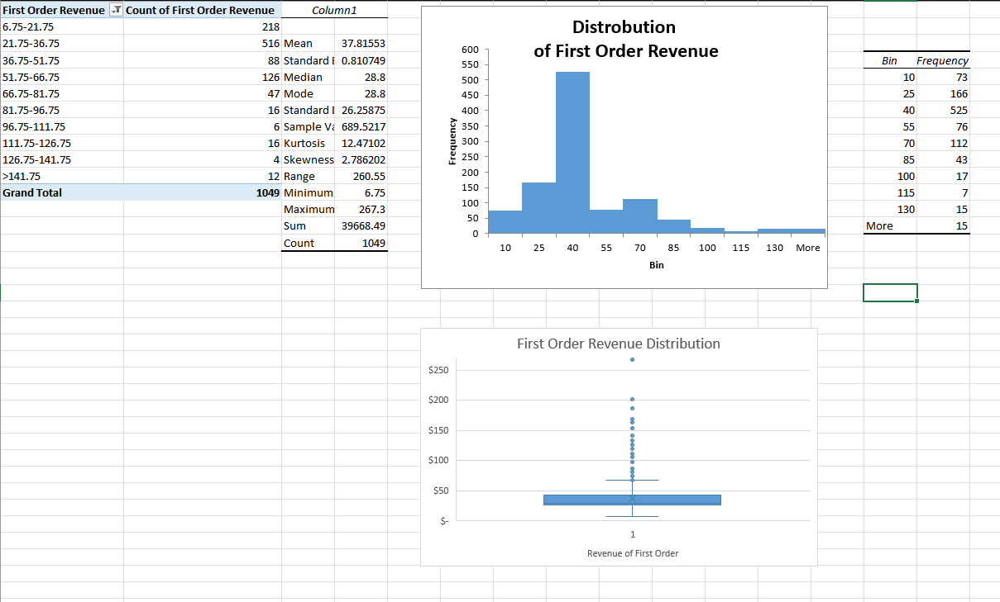
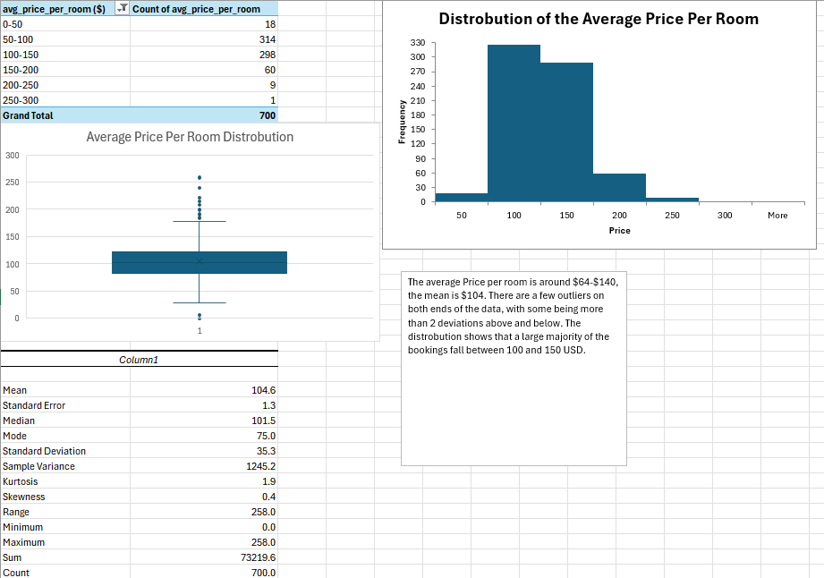
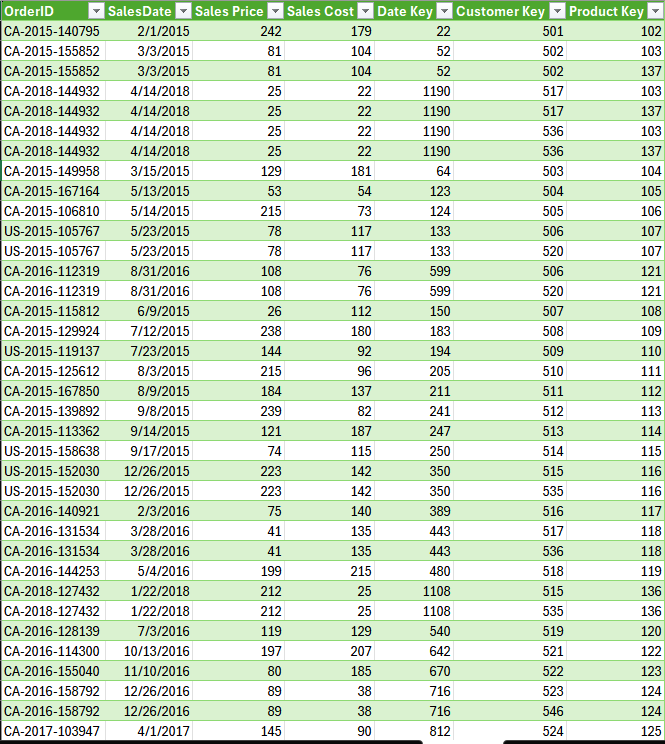

# Excel & BI Analytics Projects — Cade Miller
Business Analytics, Northern Arizona University (Class of 2027)

Business intelligence and data analysis projects using 
Microsoft Excel, Power Query, Power Pivot, and DAX. Each 
project starts with raw data, applies cleaning and 
transformation, and ends with analytical findings and 
business recommendations.

---

## Projects

### Bombas Socks Customer Revenue Dashboard
**Tools:** Tableau, Excel, Power Query  
**Files:** `BombasData_Completed.xlsx`  

Analyzed first-order revenue and customer behavior data 
across 1,000+ records for Bombas, a direct-to-consumer 
sock brand.

**Excel workbook (8 analysis sheets):**
- Average revenue by month
- Average revenue by hour of day
- Average revenue by day of week
- Count of first orders by purchase day
- Count of first orders by purchase date
- Items purchased distribution
- Average and count combined view
- Raw data

**Tableau dashboard (3 views):**
- First-order revenue by month (trend line)
- Geographic map of first orders by U.S. state
- Purchase timing analysis by hour and day

Key findings: Identified peak purchasing windows by time 
of day and day of week, enabling more targeted promotion 
timing. Geographic view revealed regional demand 
concentration. Full funnel tracking (site visits → 
product views → add-to-cart → checkout → orders) 
surfaced conversion drop-off points.

---

### Hotel Reservation Cancellation Analysis
**Tools:** Excel (Power Query, Pivot Tables)  
**File:** `Hotel_Reservation_Dataset_Deliverable_2.xlsx`

Cleaned and analyzed a 700-record hotel booking dataset 
to identify drivers of cancellations and revenue risk.

**Workbook structure (13 sheets):**
- Cleaned dataset
- Data dictionary
- Source documentation
- Cross-tabulation sheets: booking status × market segment, 
  booking status × lead time, booking status × room price, 
  and all pairwise combinations of key variables

Key findings:
- 74% of bookings originated through online channels
- 29.6% overall cancellation rate
- Cancellations concentrated in bookings with lead times 
  over 30 days
- October had the highest booking volume; January the lowest

Business recommendations:
1. Implement deposit policy for bookings more than 30 days 
   out to reduce cancellation rate
2. Increase seasonal staffing from June through October 
   to match demand peaks
3. Prioritize marketing investment in the online segment 
   as the primary revenue channel

---

### Retail Sales Star Schema & Data Model
**Tools:** Excel (Power Query, Power Pivot, DAX)  
**File:** `Lab_5_BAN445_StarSchema.xlsx`

Built a production-style star schema data model from a 
raw retail sales dataset using Excel's built-in BI stack.

**Schema structure:**
| Table | Type | Key Fields |
|---|---|---|
| Fact Table | Fact | OrderID, DateKey, CustomerKey, ProductKey, Sales Price, Sales Cost |
| Product Table | Dimension | ProductKey, ProductName, Category |
| Customer Table | Dimension | CustomerKey, CustomerName, City, State |
| Date Table | Dimension | DateKey, SalesDate, Year, Month, Day of Week |

Power Query used for ETL — data cleaning, type 
conversions, and key column creation across all four 
tables. DAX measures built for cross-table aggregation, 
enabling slice-and-dice analysis by product, customer, 
and time period. Model structure mirrors the approach 
used in production Power BI environments.

---

## Skills Demonstrated
- Data cleaning and preparation (Power Query)
- ETL pipeline design
- Star schema / dimensional data modeling
- DAX measure creation for cross-table calculations
- Pivot table analysis and cross-tabulation
- Business insight extraction and recommendation writing
- Data dictionary and source documentation

---

## Tools
Microsoft Excel · Power Query · Power Pivot · DAX · 
Tableau · Pivot Tables

